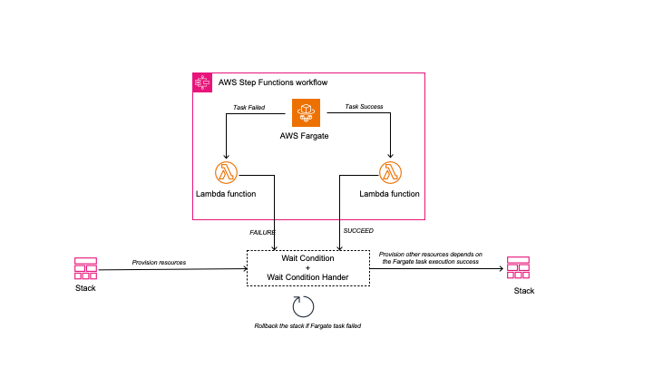

# Waitcondition Hook for AWS Fargate task
WaitCondition hook for AWS Fargate tasks is a AWS CDK Construct that helps builders to run a AWS Fargate task with one or multiple container embedded into a CloudFormation lifecycle. You can use this construct add dependency between resources and the AWS Fargate task execution result (eg. Database migration, image build and packing, invoking third party/on-prem API). waitcondition-hook-for-aws-fargate-task construct will also handle the failure of the task, and rollback the CloudFormation stack after. 

## Target architecture

## Usage:
```typescript
import * as cdk from 'aws-cdk-lib';
import { RemovalPolicy } from 'aws-cdk-lib';
import { Vpc } from 'aws-cdk-lib/aws-ec2';
import * as ecr from 'aws-cdk-lib/aws-ecr';
import * as ecs from 'aws-cdk-lib/aws-ecs';
import { LogGroup } from 'aws-cdk-lib/aws-logs';
import { Construct } from 'constructs';
import { FargateRunner } from 'waitcondition-hook-for-aws-fargate-task';
import { Queue } from 'aws-cdk-lib/aws-sqs';

export class FargateRunnerTestStack extends cdk.Stack {
    constructor(scope: Construct, id: string, props?: cdk.StackProps) {
        super(scope, id, props);
        // Define the VPC
        const vpc = new Vpc(this, 'MyVpc')
        // Define the Fargate Task
        const taskDefinition = new ecs.FargateTaskDefinition(this, 'MyTask', {});
        // Import exiting ecr repo
        const repo = ecr.Repository.fromRepositoryName(this, 'MyRepo', 'RepoName');
        // Add a container to the task
        taskDefinition.addContainer('MyContainer', {
            image: ecs.ContainerImage.fromEcrRepository(repo),
        });
        // Create the Fargate runner
        const myFargateRunner = new FargateRunner(this, 'MyRunner', {
            fargateTaskDef: taskDefinition,
            timeout: `${60 * 5}`,
            vpc: vpc,
        });
        // Create the SQS queue
        const myQueue = new Queue(this, 'MyQueue', {});
        // Add dependency
        myQueue.node.addDependency(myFargateRunner);
    }
}
const app = new cdk.App();

const env = {
    account: process.env.CDK_DEFAULT_ACCOUNT,
    region: process.env.CDK_DEFAULT_REGION,
};
new FargateRunnerTestStack(app, 'FargateRunnerTestStack', { env: env });
```

With AWS CDK script above (in typescript), it will create a AWS Faragate task and run in a ECS Cluster, with the the task definition that defined. The SQS queue which depends on the will be create only after the Fargate task execute complete and succeed (exit with EXIT CODE: 0)